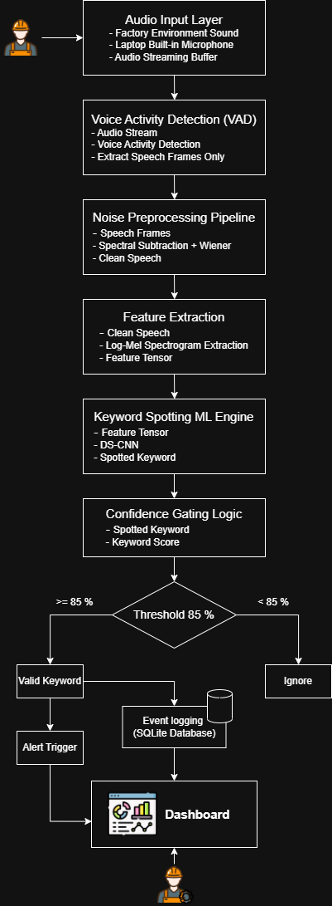

# Factory-Safety-Voice-Detection-System

## Problem Statement

In heavy industrial and manufacturing environments, workers often face safety-critical
situations where immediate communication is required to prevent accidents or operational
hazards. Existing emergency reporting mechanisms such as manual switches, handheld
devices, or cloud-dependent voice assistants can be unreliable because of background
noise, limited mobility, and network constraints.

This project aims to build a real-time, noise-robust, hands-free safety reporting system
that continuously processes streaming audio, identifies safety-critical voice commands
under noisy industrial conditions, and provides real-time alert notifications with
analytics support for safety monitoring.

## Architectural Diagram



## Preprocessed Dataset

Link: https://drive.google.com/file/d/10Nqfo0jZ8aCeAx5tEw2U58V1s0l3qCVs/view?usp=sharing

## Agentic AI Alert Layer

The real-time pipeline now includes an agentic alert decision layer after keyword
detection:

```text
Audio Input
   -> VAD
   -> Feature Extraction
   -> Keyword Model
   -> Agentic Alert Decision
   -> Dashboard Alert / Ignore / Supervisor Notification Flag
```

The agent receives structured detection context such as keyword, confidence, threshold,
noise level, device ID, and factory zone. It returns a structured decision with:

- `emergency`
- `action`
- `alarm_type`
- `reason`
- `notify_supervisor`
- `severity`
- `source`

The decision is also converted into a dashboard-ready JSON event and appended to
`dashboard_events.jsonl` by default. Different detected hazards produce different
dashboard alarm types:

```text
stop      -> emergency_stop      -> halt_machine
fire      -> fire_alarm          -> evacuate_area
help      -> worker_assistance   -> notify_supervisor
emergency -> emergency_response  -> dispatch_emergency_response
danger    -> hazard_warning      -> raise_hazard_warning
```

By default, the project uses a safety-first rules fallback. If `GROQ_API_KEY` is set,
the system calls Groq for contextual reasoning and explanation. A guardrail keeps
high-confidence critical detections active even if the LLM disagrees or is unavailable.

Optional environment variables:

```text
GROQ_API_KEY=your_groq_key
GROQ_MODEL=llama-3.1-8b-instant
DEVICE_ID=edge-device-1
FACTORY_ZONE=factory-floor
DASHBOARD_EVENTS_PATH=dashboard_events.jsonl
```

## Project Structure

```text
factory-safety-voice-detection/
|-- assets/
|   |-- audio_utils.py
|   |-- noise_reduction.py
|   |-- feature_utils.py
|   |-- config.py
|   `-- logger.py
|-- program/
|   |-- audio_input.py
|   |-- vad.py
|   |-- preprocessing.py
|   |-- feature_extraction.py
|   |-- keyword_spotting.py
|   |-- confidence_gate.py
|   |-- agentic_alert.py
|   `-- main.py
|-- models/
|   |-- ds_cnn_model.pth
|   |-- labels.txt
|   `-- model_loader.py
|-- dataset/
|-- tests/
|-- scripts/
|-- requirements.txt
`-- run.py
```

## Run

```bash
python run.py
```

## Test

```bash
python -m pytest tests
```
